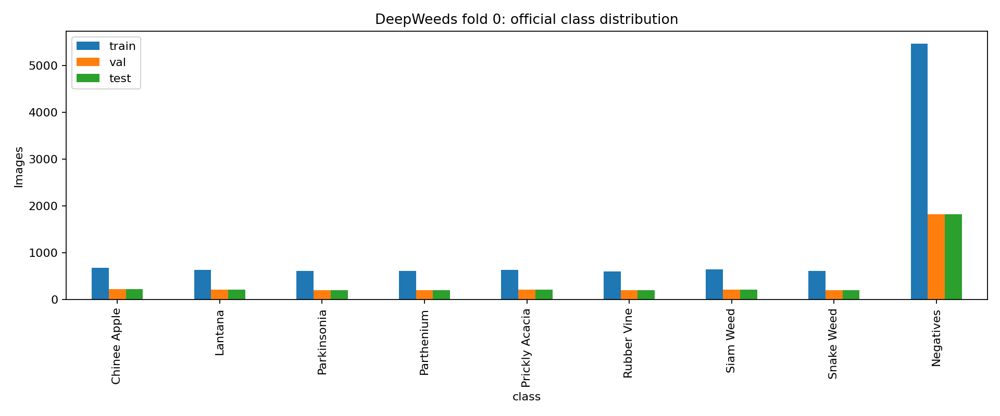
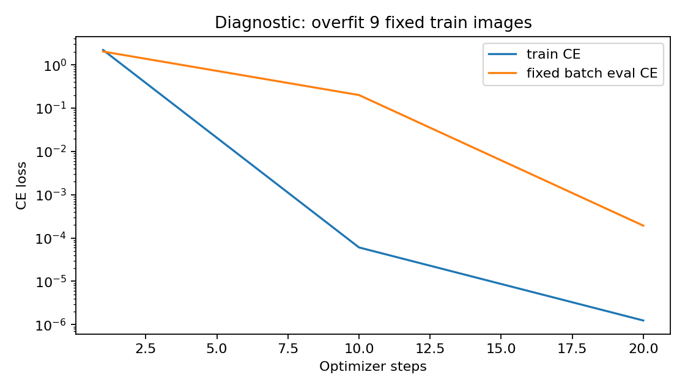
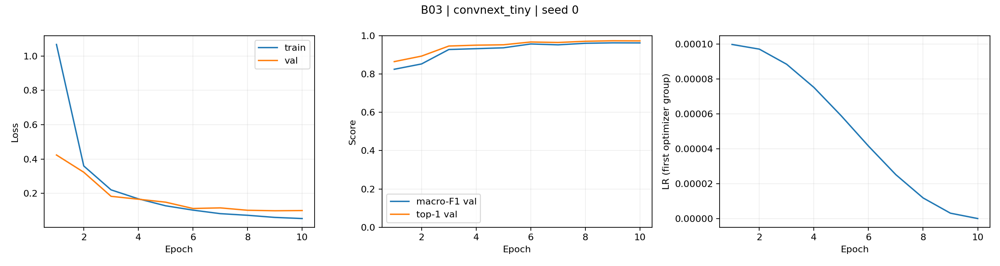
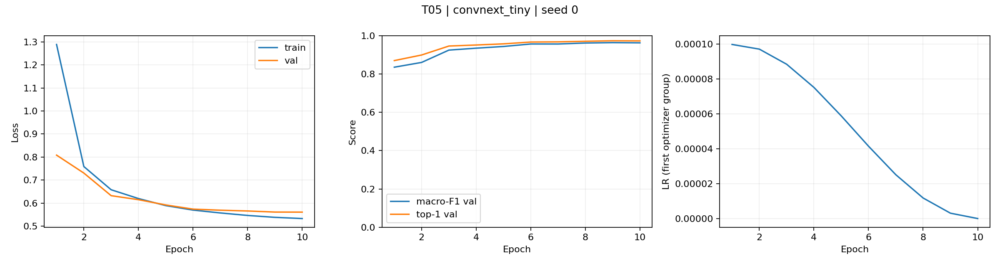
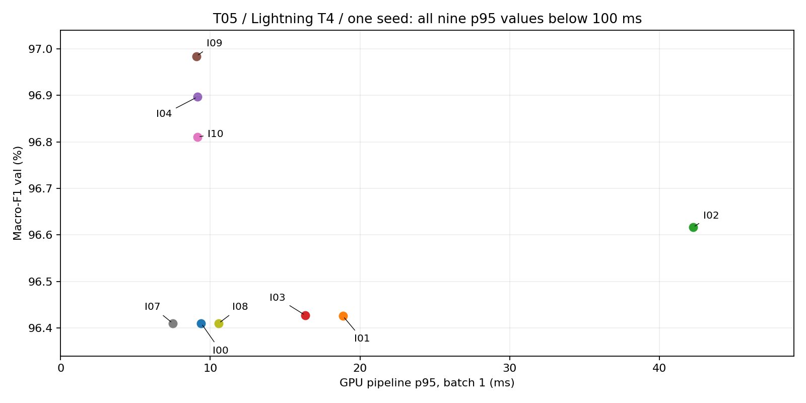
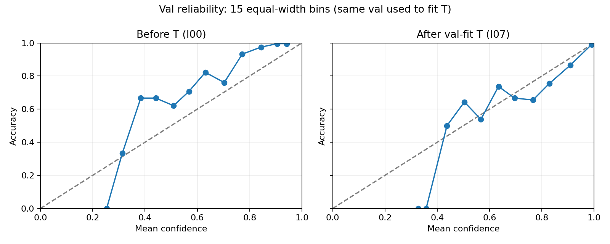

# DeepWeeds — So sánh backbone, công thức huấn luyện và suy luận

**Trạng thái: báo cáo trước vòng chung kết. Bước 0–3 đã xong; Bước 4 chưa chạy.
Chưa có điểm test, mean ± std qua seed hoặc ma trận nhầm lẫn test. Chưa đủ điều kiện nộp cuối.**

## 1. Tóm tắt

Bài toán phân loại chín lớp trên DeepWeeds, fold 0 gốc. Đã hoàn thiện pipeline,
so sánh năm backbone, sáu ablation riêng và một kết hợp theo ba trục, chín cấu hình suy luận.
Tất cả lựa chọn đến thời điểm này dựa trên val 3.501 ảnh, mỗi cấu hình một seed.
ConvNeXt-Tiny được chọn; công thức T05 dùng label smoothing 0.1. Cấu hình I09 ảnh 288
đạt macro-F1 val 96.98%, top-1 97.71%, p95 9.068 ms
trên pipeline GPU T4 Lightning. Bước 4 sẽ kiểm chứng bằng ba seed cùng mốc T00/I00.
Không xem điểm test để sửa cấu hình. Kết luận về ưu thế ổn định còn chờ mean ± std.

## 2. Dữ liệu và thiết lập

Dùng nguyên CSV train_subset0/val_subset0/test_subset0 của tác giả, không chia lại,
không sửa nhãn fold. Train 10.501, val 3.501, test 3.507; hợp 17.509, các giao bằng 0.
Test ở đây chỉ được kiểm tra metadata/sự tồn tại file, chưa chạy model hay xem ảnh test.
Lớp Negative chiếm khoảng 52%, vì vậy macro-F1 chín lớp là chỉ số chọn chính.

| Lớp | Train | Val | Test (metadata) | Tổng | Δ Table 1 |
| --- | --- | --- | --- | --- | --- |
| Chinee Apple | 675 | 225 | 226 | 1126 | 1 |
| Lantana | 637 | 213 | 213 | 1063 | -1 |
| Parkinsonia | 618 | 206 | 207 | 1031 | 0 |
| Parthenium | 613 | 204 | 205 | 1022 | 0 |
| Prickly Acacia | 637 | 212 | 213 | 1062 | 0 |
| Rubber Vine | 605 | 202 | 202 | 1009 | 0 |
| Siam Weed | 644 | 215 | 215 | 1074 | 0 |
| Snake Weed | 609 | 203 | 204 | 1016 | 0 |
| Negatives | 5463 | 1821 | 1822 | 9106 | 0 |

Số đếm gốc lệch Table 1 một ảnh ở Chinee Apple/Lantana. Có một nhãn train khác master
labels.csv (20170714-110407-3.jpg); giữ Label=0 của train_subset0 theo quy tắc fold 0,
không tự sửa thành nhãn master. Xem step0/label_discrepancies.csv và step0_report.md.
Ảnh RGB 256×256; train RandomResizedCrop224 và lật ngang, val resize256/CenterCrop224.
Mean/std/nội suy theo đúng pretrained_cfg của mỗi tag. Dò kích thước suy luận giữ
tỷ lệ resize/crop 256/224; ở 288 resize329 rồi crop288, không thay trọng số.

Công thức nền dùng finetune toàn bộ từ ImageNet, head mới chín lớp, AdamW,
LR backbone/head 1e-4/1e-3, weight decay0.05 trừ norm/bias, warmup1 epoch và cosine,
CE, AMP train. Tất cả backbone/ablation có 10 epoch, batch32, seed0, checkpoint
macro-F1 val cao nhất và hòa lấy epoch sớm. Batch/epoch giảm theo ngân sách và được
áp dụng chung. Train drop_last bỏ batch thiếu; 10.496 ảnh/epoch sau shuffle, không sửa CSV.
T05 chỉ đổi CE sang label smoothing0.1. Loss có smoothing không so trực tiếp trị số với CE.

Bước 1/2 dùng Colab T4, torch2.11.0+cu130, torchvision0.26.0+cu130, timm1.0.30.
Bước 3 chuyển sang Lightning T4 do hết hạn mức Colab: torch2.8.0+cu128,
torchvision0.23.0+cu128, CUDA12.8, cuDNN91002, timm1.0.30.
Đã nạp đúng SHA-256 checkpoint T05 và đối chiếu toàn bộ logits val, sai số lớn nhất
3.3975e-6, dự đoán lớp trùng. Môi trường train và môi trường suy luận được ghi riêng.

## 3. Tính đúng đắn của pipeline

Loss CE ban đầu 2.1827, gần log9≈2.1972. Overfit một batch chín ảnh
đạt loss 0.0001933 và accuracy100% sau 20 bước.
Đây chỉ là chẩn đoán; trọng số chẩn đoán không dùng cho thí nghiệm. Kiểm tra frozen
backbone giữ BN/dropout đúng eval, weight decay loại norm/bias, scheduler và EMA có kiểm tra.
Test của evaluator có fixture CSV sai cố ý; thông báo lỗi trong /tmp của fixture không
phải lỗi bộ dữ liệu hay bằng chứng đã đánh giá test thật. Test ledger chung kết nằm riêng.

## 4. So sánh backbone

| ID | Backbone/tag | Params M | GMAC | F1 val | Top-1 val | Train s/epoch |
| --- | --- | --- | --- | --- | --- | --- |
| B01 | resnet50/a1_in1k | 23.526 | 4.109 | 85.73% | 89.32% | 49.23 |
| B02 | resnext50_32x4d/a1h_in1k | 22.998 | 4.257 | 83.28% | 86.92% | 58.04 |
| B03 | convnext_tiny/fb_in1k | 27.827 | 4.470 | 96.30% | 97.37% | 63.28 |
| B04 | deit_small_patch16_224/fb_in1k | 21.669 | 4.608 | 95.57% | 96.86% | 43.04 |
| B05 | efficientnet_b0/ra_in1k | 4.019 | 0.398 | 85.93% | 89.35% | 46.76 |

Đủ ResNet, ResNeXt, transformer DeiT và mạng nhẹ EfficientNet. ConvNeXt-Tiny đứng đầu,
DeiT-Small thứ hai, chênh khoảng0.728 pp. Mỗi backbone một seed nên đây là thứ hạng sàng lọc.
ConvNeXt đạt 95% đỉnh riêng từ epoch3; DeiT/ResNet/ResNeXt từ epoch4, EfficientNet từ epoch5.
Không thấy loss val tăng liên tục trong ba epoch cuối của B-stage. Thời điểm này
không chứng minh hội tụ hoàn toàn hoặc không thể overfit nếu train lâu hơn.

GMAC không dự đoán chắc tốc độ: DeiT có GMAC cao nhưng train/epoch nhanh hơn ResNet ở lần đo này.
Preliminary latency B-stage chỉ một forward sau warmup, không đem so với phân vị Bước 3.
Tag ImageNet có lịch sử pretrain khác nhau; cùng công thức finetune không xóa khác biệt đó.
Thứ hạng pretrained ImageNet không tự chuyển thành thứ hạng macro-F1 DeepWeeds.
Xem phân tích/tag tương ứng trong step1/step1_report.md.

## 5. Công thức huấn luyện

| ID | Thay đổi | F1 val | Δ T00 (pp) | ECE val |
| --- | --- | --- | --- | --- |
| T00 | B03 reused; no new training | 96.30% | +0.0000 | 0.00801 |
| T01 | Scratch | 33.60% | -62.6993 | 0.02011 |
| T02 | Frozen backbone | 71.53% | -24.7730 | 0.05398 |
| T03 | ColorJitter | 95.56% | -0.7417 | 0.00928 |
| T04 | CutMix alpha=1 | 96.30% | +0.0013 | 0.02505 |
| T05 | Label smoothing epsilon=0.1 | 96.41% | +0.1075 | 0.09615 |
| T06 | Focal gamma=2 | 96.25% | -0.0479 | 0.06809 |
| T07 | T04 + T05 | 96.15% | -0.1564 | 0.11209 |

Ba trục: khởi tạo (finetune/scratch/frozen), augmentation (basic/color/CutMix),
loss (CE/label smoothing/focal). T00 dùng lại B03; T01–T06 chỉ đổi một yếu tố,
T07 kiểm tra CutMix+label smoothing đã chọn trên val. Scratch/frozen thấp hơn rõ trong
ngân sách10 epoch, nhưng chưa chứng minh scratch vẫn thấp nếu train lâu hơn.
ColorJitter làm giảm F1; CutMix tăng khoảng0.0013 pp, gần như ngang mốc trong lần chạy.
T05 hơn T00 khoảng0.1075 pp nhưng bootstrap val95% cho Δ[-0.3389;+0.4542] pp chứa0;
bootstrap theo mẫu val không thay std qua seed. T07 kém T05 khoảng0.264 pp,
không thấy hiệu ứng cộng dồn ở lần chạy này. T05 được chọn theo quy tắc F1, chưa chứng minh
ưu thế ổn định. Raw ECE T05 cao hơn T00; tối ưu F1 không đồng nghĩa xác suất được hiệu chuẩn tốt.

## 6. Suy luận, hiệu chuẩn và độ trễ

| ID | Suy luận | F1 val | Top-1 val | ECE | p50/p95/p99 ms | Ảnh/s batch32 |
| --- | --- | --- | --- | --- | --- | --- |
| I00 | 1 view FP32 | 96.41% | 97.37% | 0.09615 | 8.171/9.390/9.760 | 287.9 |
| I01 | Hflip TTA / probability | 96.43% | 97.34% | 0.09709 | 15.593/18.862/20.783 | 141.7 |
| I02 | 5 crops / probability | 96.62% | 97.54% | 0.09960 | 25.504/42.253/44.456 | 56.0 |
| I03 | Hflip TTA / logits | 96.43% | 97.34% | 0.09718 | 14.316/16.359/17.286 | 140.0 |
| I04 | Resolution 256 | 96.90% | 97.66% | 0.09549 | 5.763/9.138/9.337 | 219.5 |
| I09 | Resolution 288 | 96.98% | 97.71% | 0.10381 | 8.536/9.068/9.182 | 168.3 |
| I10 | Resolution 320 | 96.81% | 97.63% | 0.11564 | 8.567/9.153/9.225 | 141.1 |
| I07 | 1 view + temperature | 96.41% | 97.37% | 0.00474 | 5.064/7.491/8.597 | 280.7 |
| I08 | 1 view AMP FP16 | 96.41% | 97.37% | 0.09613 | 7.083/10.559/11.857 | 721.0 |

I09 so I00 tăng 0.5735 pp trên cùng checkpoint.
Tăng ảnh lên320 không tăng thêm F1. Hflip prob/logit rất gần nhau; không có bằng chứng
một phép gộp luôn tốt hơn. Five-crop tăng F1 ít hơn ảnh288 nhưng p95≈42.25ms,
khoảng4.66 lần p95 I09; chi phí p50 tương đối trong workbook dùng I00 làm mẫu số.
TTA có giá trị khi chấp nhận chi phí, nhưng trong screening này I09 một view có F1 cao hơn
và nhanh hơn five-crop. Không thử ensemble/soup/EMA; T05 không được train EMA.
ConvNeXt dùng LayerNorm, không có BN, nên fusion BN không áp dụng; helper có kiểm tra
Conv→BN an toàn và sai số≤1e-5 trên fixture.

I07 khớp T=0.6106658952 bằng NLL trên val224; ECE0.09615→0.00474,
NLL0.18525→0.10608, top-1/F1 giữ nguyên. Khớp và đo trên cùng val nên hiệu chuẩn
có thể lạc quan. Không áp T này sang ảnh288 hoặc test của một seed mới.
Protocol F01 khai báo bổ sung calibration val288 riêng mỗi seed trước test.

AMP có p95 batch1 cao hơn FP32 I00 (10.56 so9.39ms) dù p50 thấp hơn,
nhưng throughput batch32≈721 so≈288 ảnh/s. Không kết luận AMP luôn nhanh hơn ở batch1.
I07 và I04 có p50 thấp hơn I00 dù đồ thị tính toán không cho một lý do rõ để nhanh hơn nhiều.
Các lượt timing được đo theo từng chuỗi riêng, nên độ biến động GPU/host/kernel có thể ảnh hưởng;
không gọi temperature scaling là kỹ thuật tăng tốc. Mọi cấu hình đều p95<100ms ở lần đo này.

Mỗi phương pháp: 10warmup bỏ đi,100 lần đồng bộ CUDA trước/sau, đo bằng perf_counter,
batch1 và32, lưu raw samples để tính lại p50/p95/p99. Thông lượng=batch/meanseconds.
Pipeline bắt đầu từ tensor đã normalize trênGPU; gồm flip/crop, model, softmax/gộp/chiaT,
không gồm đọc ảnh, PIL, H2D/D2H, camera hay tải model. Vì vậy p95≤100ms chưa chứng minh
toàn hệ thống robot≤100ms. Không trộn latency Colab với Lightning.

## 7. Chung kết và phần còn thiếu

**Chưa có kết quả test.** F00=T00/I00 làm mốc; F01=T05/I09+val-fitT là cấu hình chính.
Hai nhóm sẽ train lại từ ImageNet với seed0/1/2, cùng môi trường/epoch/batch.
Chọn checkpoint trên val224, khớp T trên val288 cho F01, khóa cả sáu trước lượt test đầu.
Mỗi model/seed chỉ forward toàn bộ test một lần. Bản uncalibrated tạo từ cùng logits.
Notebook step4_lightning.ipynb và step4/plan.md mô tả protocol đã chốt trước test.

Sau sáu lượt cần báo cáo mean±std mẫu(ddof=1) cho val/test, ΔF1 so mốc và std lớn hơn
giữa hai nhóm, recall Chinee Apple/SnakeWeed, ECE trước/sau, confusion counts và ảnh lỗi.
eval.py gốc sẽ tính lại từ predictions/F00/F01_seed*_test.csv. Không chọn seed đẹp nhất.
Final/PerClass hiện chỉ có dòng chờ kết quả; không dùng số val điền cột test.
Ngân sách ước lượng1.5–2giờ cho sáu lượt và đánh giá, Lightning thực tế có thể khác.

## 8. Kết luận hiện tại và hạn chế

Backbone tạo chênh lệch lớn hơn recipe ở screening. T05 được chọn bằng val nhưng cần
nhiều seed xác nhận. Dò độ phân giải288 hiệu quả hơn các TTA đã thử trong một checkpoint.
Đề xuất triển khai tạm thời là một view288 FP32, với T khớp đúng val của mô hình triển khai;
đây là lựa chọn để kiểm chứng, chưa phải kết luận từ test. Với xử lý batch lớn, AMP đáng
cân nhắc theo throughput đã đo, nhưng không đổi F01 dtype sau khi xem điểm test.

Giới hạn: một fold, screening một seed, batch32/10epoch, ablation một backbone,
không có ensemble/EMA, không đo toàn hệ thống. Split ngẫu nhiên không theo địa điểm
có thể lạc quan khi sang cánh đồng/mùa/ánh sáng mới. Bài báo DeepWeeds dùng khoảng100epoch
và augmentation khác; không so trực tiếp với mốc95.7% như hai điều kiện tương đương.
Chưa xác nhận ba seed, test và sáu sản phẩm cuối. Không có std giả hoặc ma trận test giả.

## 9. Tái lập và bằng chứng

Xem REPRODUCE.md; notebook/code trong notebooks/ và code/. Danh sách exp_id và cấu hình
trong step1/backbones.json, step2/ablations.json, step3/inference.json và step4/frozen_plan.json.
Curves đầy đủ từng B/T trong curves/. Pred CSV val trong predictions/; test chưa có.
Source/checkpoint hashes trong step3/source.json; môi trường đo trong runtime.json;
100 samples mỗi lượt trong step3/Ixx/latency_batch1/32.json. ZIP/checkpoint lớn lưu ngoàiGit.
