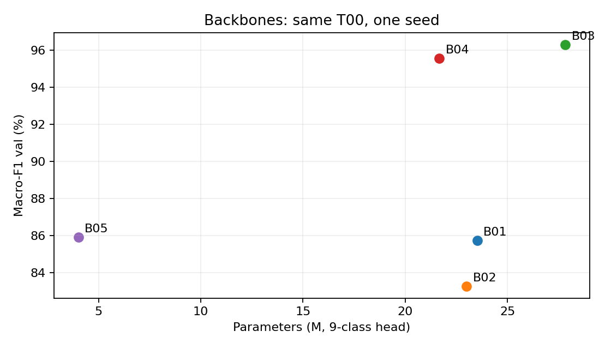
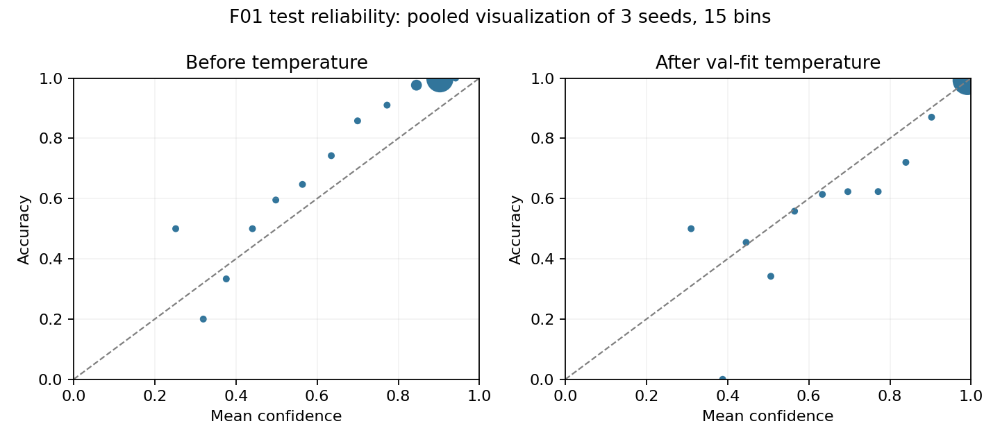
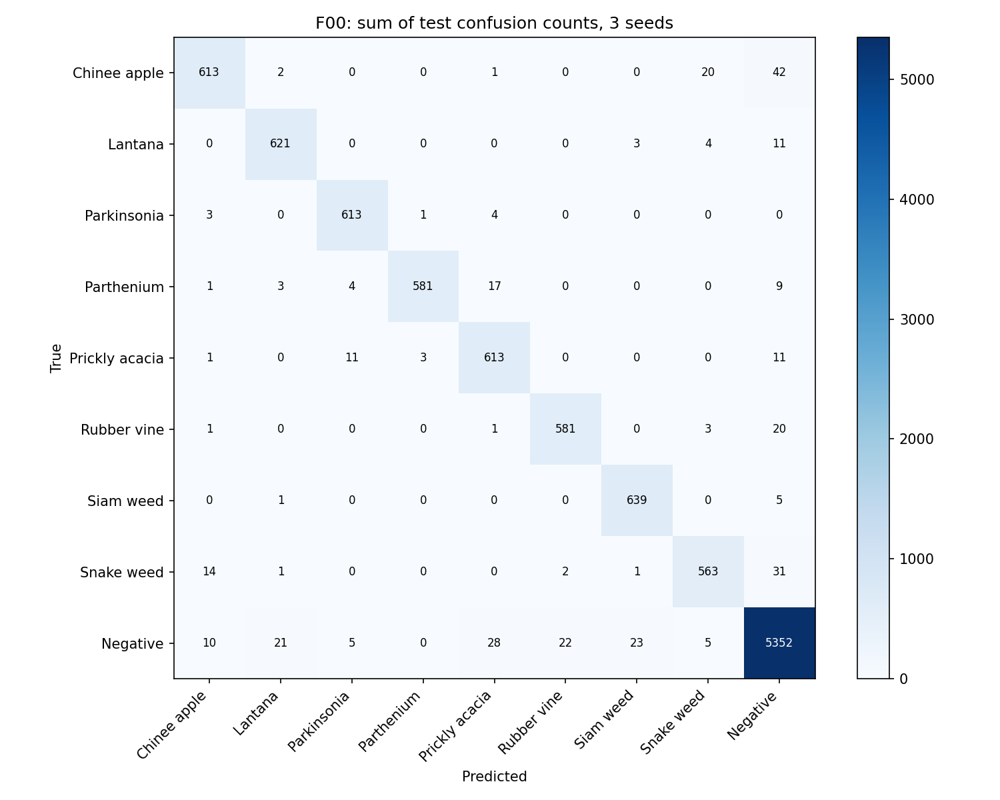
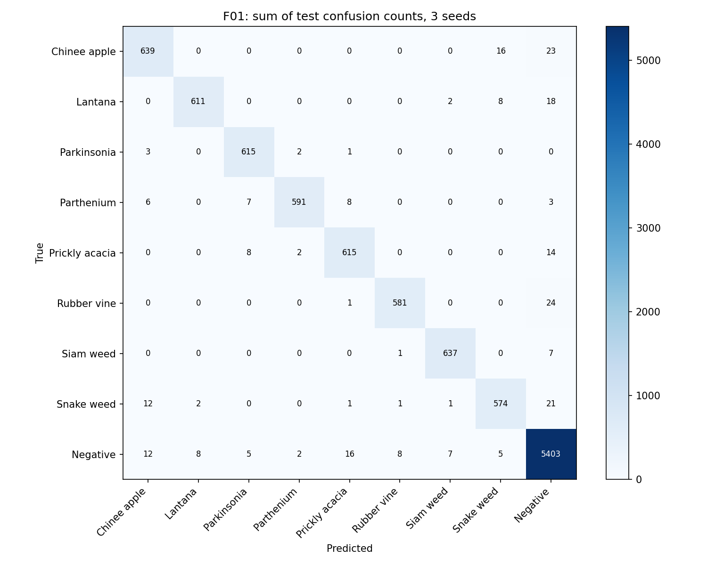
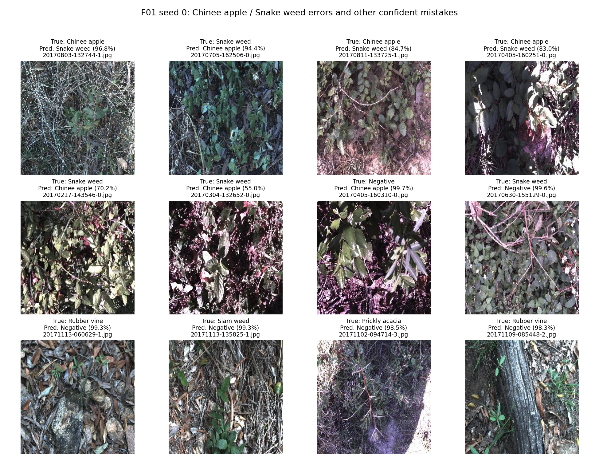

# DeepWeeds — So sánh backbone, công thức huấn luyện và suy luận

**Trạng thái: đã hoàn thành Bước 0–5. Kết quả chung kết được tính lại bằng eval.py gốc.**

## 1. Tóm tắt

Phân loại chín lớp DeepWeeds, fold 0; năm backbone, ba trục công thức huấn luyện,
một kết hợp và chín cấu hình suy luận được sàng lọc trên val. Cấu hình chốt trước test:
ConvNeXt-Tiny fb_in1k, label smoothing 0.1, một view 288 FP32, T khớp riêng trên val.
Ba seed đạt macro-F1 test **96.86 ± 0.27%** và top-1
**97.58 ± 0.19%**. F1 tăng **1.03 pp** so mốc
T00/I00, vượt std lớn hơn 0.38 pp. ECE test giảm 0.09996→0.00708;
p95 batch 1 cao nhất **8.790 ms** trên T4, chưa gồm camera/tiền xử lý/transfer.
Mọi lựa chọn khóa trên val; mỗi model/seed test một lượt. Giới hạn chính là một fold
và chia ngẫu nhiên, nên chưa bảo đảm hiệu quả trên miền hoặc hệ thống robot mới.

## 2. Dữ liệu và thiết lập

Dùng nguyên CSV train_subset0/val_subset0/test_subset0 của tác giả, không chia lại,
không sửa nhãn fold. Train 10.501, val 3.501, test 3.507; hợp 17.509, các giao bằng 0.
Trong Bước 0–3, test chỉ dùng metadata/sự tồn tại file. Bước 4 mới chạy model test theo kế hoạch đã khóa.
Lớp Negative chiếm khoảng 52%, vì vậy macro-F1 chín lớp là chỉ số chọn chính.

| Lớp | Train | Val | Test (metadata) | Tổng | Δ Table 1 |
| --- | --- | --- | --- | --- | --- |
| Chinee Apple | 675 | 225 | 226 | 1126 | 1 |
| Lantana | 637 | 213 | 213 | 1063 | -1 |
| Parkinsonia | 618 | 206 | 207 | 1031 | 0 |
| Parthenium | 613 | 204 | 205 | 1022 | 0 |
| Prickly Acacia | 637 | 212 | 213 | 1062 | 0 |
| Rubber Vine | 605 | 202 | 202 | 1009 | 0 |
| Siam Weed | 644 | 215 | 215 | 1074 | 0 |
| Snake Weed | 609 | 203 | 204 | 1016 | 0 |
| Negatives | 5463 | 1821 | 1822 | 9106 | 0 |

Số đếm gốc lệch Table 1 một ảnh ở Chinee Apple/Lantana. Có một nhãn train khác master
labels.csv (20170714-110407-3.jpg); giữ Label=0 của train_subset0 theo quy tắc fold 0,
không tự sửa thành nhãn master. Xem step0/label_discrepancies.csv và step0_report.md.
Ảnh RGB 256×256; train RandomResizedCrop224 và lật ngang, val resize256/CenterCrop224.
Mean/std/nội suy theo đúng pretrained_cfg của mỗi tag. Dò kích thước suy luận giữ
tỷ lệ resize/crop 256/224; ở 288 resize329 rồi crop288, không thay trọng số.

Công thức nền dùng finetune toàn bộ từ ImageNet, head mới chín lớp, AdamW,
LR backbone/head 1e-4/1e-3, weight decay0.05 trừ norm/bias, warmup1 epoch và cosine,
CE, AMP train. Tất cả backbone/ablation có 10 epoch, batch32, seed0, checkpoint
macro-F1 val cao nhất và hòa lấy epoch sớm. Batch/epoch giảm theo ngân sách và được
áp dụng chung. Train drop_last bỏ batch thiếu; 10.496 ảnh/epoch sau shuffle, không sửa CSV.
T05 chỉ đổi CE sang label smoothing0.1. Loss có smoothing không so trực tiếp trị số với CE.

Bước 1/2 dùng Colab T4, torch2.11.0+cu130, torchvision0.26.0+cu130, timm1.0.30.
Bước 3 chuyển sang Lightning T4 do hết hạn mức Colab: torch2.8.0+cu128,
torchvision0.23.0+cu128, CUDA12.8, cuDNN91002, timm1.0.30.
Đã nạp đúng SHA-256 checkpoint T05 và đối chiếu toàn bộ logits val, sai số lớn nhất
3.3975e-6, dự đoán lớp trùng. Môi trường train và môi trường suy luận được ghi riêng.

## 3. Tính đúng đắn của pipeline

Loss CE ban đầu 2.1827, gần log9≈2.1972. Overfit một batch chín ảnh
đạt loss 0.0001933 và accuracy100% sau 20 bước.
Đây chỉ là chẩn đoán; trọng số chẩn đoán không dùng cho thí nghiệm. Kiểm tra frozen
backbone giữ BN/dropout đúng eval, weight decay loại norm/bias, scheduler và EMA có kiểm tra.
Test của evaluator có fixture CSV sai cố ý; thông báo lỗi trong /tmp của fixture không
phải lỗi bộ dữ liệu hay bằng chứng đã đánh giá test thật. Test ledger chung kết nằm riêng.

## 4. So sánh backbone

| ID | Backbone/tag | Params M | GMAC | F1 val | Top-1 val | Train s/epoch |
| --- | --- | --- | --- | --- | --- | --- |
| B01 | resnet50/a1_in1k | 23.526 | 4.109 | 85.73% | 89.32% | 49.23 |
| B02 | resnext50_32x4d/a1h_in1k | 22.998 | 4.257 | 83.28% | 86.92% | 58.04 |
| B03 | convnext_tiny/fb_in1k | 27.827 | 4.470 | 96.30% | 97.37% | 63.28 |
| B04 | deit_small_patch16_224/fb_in1k | 21.669 | 4.608 | 95.57% | 96.86% | 43.04 |
| B05 | efficientnet_b0/ra_in1k | 4.019 | 0.398 | 85.93% | 89.35% | 46.76 |

Đủ ResNet, ResNeXt, transformer DeiT và mạng nhẹ EfficientNet. ConvNeXt-Tiny đứng đầu,
DeiT-Small thứ hai, chênh khoảng0.728 pp. Mỗi backbone một seed nên đây là thứ hạng sàng lọc.
ConvNeXt đạt 95% đỉnh riêng từ epoch3; DeiT/ResNet/ResNeXt từ epoch4, EfficientNet từ epoch5.
Không thấy loss val tăng liên tục trong ba epoch cuối của B-stage. Thời điểm này
không chứng minh hội tụ hoàn toàn hoặc không thể overfit nếu train lâu hơn.

GMAC không dự đoán chắc tốc độ: DeiT có GMAC cao nhưng train/epoch nhanh hơn ResNet ở lần đo này.
Preliminary latency B-stage chỉ một forward sau warmup, không đem so với phân vị Bước 3.
Tag ImageNet có lịch sử pretrain khác nhau; cùng công thức finetune không xóa khác biệt đó.
Thứ hạng pretrained ImageNet không tự chuyển thành thứ hạng macro-F1 DeepWeeds.
Xem phân tích/tag tương ứng trong step1/step1_report.md.

## 5. Công thức huấn luyện

| ID | Thay đổi | F1 val | Δ T00 (pp) | ECE val |
| --- | --- | --- | --- | --- |
| T00 | B03 reused; no new training | 96.30% | +0.0000 | 0.00801 |
| T01 | Scratch | 33.60% | -62.6993 | 0.02011 |
| T02 | Frozen backbone | 71.53% | -24.7730 | 0.05398 |
| T03 | ColorJitter | 95.56% | -0.7417 | 0.00928 |
| T04 | CutMix alpha=1 | 96.30% | +0.0013 | 0.02505 |
| T05 | Label smoothing epsilon=0.1 | 96.41% | +0.1075 | 0.09615 |
| T06 | Focal gamma=2 | 96.25% | -0.0479 | 0.06809 |
| T07 | T04 + T05 | 96.15% | -0.1564 | 0.11209 |

Ba trục: khởi tạo (finetune/scratch/frozen), augmentation (basic/color/CutMix),
loss (CE/label smoothing/focal). T00 dùng lại B03; T01–T06 chỉ đổi một yếu tố,
T07 kiểm tra CutMix+label smoothing đã chọn trên val. Scratch/frozen thấp hơn rõ trong
ngân sách10 epoch, nhưng chưa chứng minh scratch vẫn thấp nếu train lâu hơn.
ColorJitter làm giảm F1; CutMix tăng khoảng0.0013 pp, gần như ngang mốc trong lần chạy.
T05 hơn T00 khoảng0.1075 pp nhưng bootstrap val95% cho Δ[-0.3389;+0.4542] pp chứa0;
bootstrap theo mẫu val không thay std qua seed. T07 kém T05 khoảng0.264 pp,
không thấy hiệu ứng cộng dồn ở lần chạy này. T05 được chọn theo quy tắc F1, chưa chứng minh
ưu thế ổn định. Raw ECE T05 cao hơn T00; tối ưu F1 không đồng nghĩa xác suất được hiệu chuẩn tốt.

## 6. Suy luận, hiệu chuẩn và độ trễ

| ID | Suy luận | F1 val | Top-1 val | ECE | p50/p95/p99 ms | Ảnh/s batch32 |
| --- | --- | --- | --- | --- | --- | --- |
| I00 | 1 view FP32 | 96.41% | 97.37% | 0.09615 | 8.171/9.390/9.760 | 287.9 |
| I01 | Hflip TTA / probability | 96.43% | 97.34% | 0.09709 | 15.593/18.862/20.783 | 141.7 |
| I02 | 5 crops / probability | 96.62% | 97.54% | 0.09960 | 25.504/42.253/44.456 | 56.0 |
| I03 | Hflip TTA / logits | 96.43% | 97.34% | 0.09718 | 14.316/16.359/17.286 | 140.0 |
| I04 | Resolution 256 | 96.90% | 97.66% | 0.09549 | 5.763/9.138/9.337 | 219.5 |
| I09 | Resolution 288 | 96.98% | 97.71% | 0.10381 | 8.536/9.068/9.182 | 168.3 |
| I10 | Resolution 320 | 96.81% | 97.63% | 0.11564 | 8.567/9.153/9.225 | 141.1 |
| I07 | 1 view + temperature | 96.41% | 97.37% | 0.00474 | 5.064/7.491/8.597 | 280.7 |
| I08 | 1 view AMP FP16 | 96.41% | 97.37% | 0.09613 | 7.083/10.559/11.857 | 721.0 |

I09 so I00 tăng 0.5735 pp trên cùng checkpoint.
Tăng ảnh lên320 không tăng thêm F1. Hflip prob/logit rất gần nhau; không có bằng chứng
một phép gộp luôn tốt hơn. Five-crop tăng F1 ít hơn ảnh288 nhưng p95≈42.25ms,
khoảng4.66 lần p95 I09; chi phí p50 tương đối trong workbook dùng I00 làm mẫu số.
TTA có giá trị khi chấp nhận chi phí, nhưng trong screening này I09 một view có F1 cao hơn
và nhanh hơn five-crop. Không thử ensemble/soup/EMA; T05 không được train EMA.
ConvNeXt dùng LayerNorm, không có BN, nên fusion BN không áp dụng; helper có kiểm tra
Conv→BN an toàn và sai số≤1e-5 trên fixture.

I07 khớp T=0.6106658952 bằng NLL trên val224; ECE0.09615→0.00474,
NLL0.18525→0.10608, top-1/F1 giữ nguyên. Khớp và đo trên cùng val nên hiệu chuẩn
có thể lạc quan. Không áp T này sang ảnh288 hoặc test của một seed mới.
Protocol F01 khai báo bổ sung calibration val288 riêng mỗi seed trước test.

AMP có p95 batch1 cao hơn FP32 I00 (10.56 so9.39ms) dù p50 thấp hơn,
nhưng throughput batch32≈721 so≈288 ảnh/s. Không kết luận AMP luôn nhanh hơn ở batch1.
I07 và I04 có p50 thấp hơn I00 dù đồ thị tính toán không cho một lý do rõ để nhanh hơn nhiều.
Các lượt timing được đo theo từng chuỗi riêng, nên độ biến động GPU/host/kernel có thể ảnh hưởng;
không gọi temperature scaling là kỹ thuật tăng tốc. Mọi cấu hình đều p95<100ms ở lần đo này.

Mỗi phương pháp: 10warmup bỏ đi,100 lần đồng bộ CUDA trước/sau, đo bằng perf_counter,
batch1 và32, lưu raw samples để tính lại p50/p95/p99. Thông lượng=batch/meanseconds.
Pipeline bắt đầu từ tensor đã normalize trênGPU; gồm flip/crop, model, softmax/gộp/chiaT,
không gồm đọc ảnh, PIL, H2D/D2H, camera hay tải model. Vì vậy p95≤100ms chưa chứng minh
toàn hệ thống robot≤100ms. Không trộn latency Colab với Lightning.

## 7. Chung kết và phân tích lỗi

F00=T00/I00 là mốc; F01=T05/I09+T khớp trên val là cấu hình chính, đã chốt trước test.
Cả hai nhóm train lại từ ImageNet trên Lightning T4, seed 0/1/2, train 224, 10 epoch,
batch 32, AdamW LR backbone/head 1e-4/1e-3, decay 0.05 trừ norm/bias, warmup 1 epoch,
cosine và AMP train. F00 dùng CE, suy luận FP32 224, T=1. F01 dùng label smoothing 0.1,
suy luận FP32 288 một view. Checkpoint chọn bằng macro-F1 val 224 (hòa lấy epoch sớm).
Mỗi seed F01 khớp một T trên NLL val 288; khóa cả sáu val trước khi mở test.
Mỗi model/seed chỉ forward test một lượt; F01_uncal lấy từ cùng logits. Tổng train+val
ghi trong history sáu lượt là 66.2 phút, chưa gồm setup/val 288/test.

| Nhóm | F1 val | F1 test | Top-1 test | ECE test | p95 cao nhất |
| --- | --- | --- | --- | --- | --- |
| F00 | 96.24 ± 0.20% | 95.83 ± 0.38% | 96.72 ± 0.25% | 0.01015 ± 0.00111 | 9.055 ms |
| F01 | 96.77 ± 0.25% | 96.86 ± 0.27% | 97.58 ± 0.19% | 0.00708 ± 0.00230 | 8.790 ms |

Mean ± std mẫu (ddof=1), ba seed, mỗi seed đủ 3.507 ảnh test. Không gộp 10.521 lượt
dự đoán thành 10.521 ảnh độc lập, không chọn seed tốt nhất.
Δ macro-F1 test F01−F00 = **1.0318 điểm phần trăm**, so với std lớn hơn
**0.3776 điểm phần trăm**; Δ vượt std và vượt 1 điểm phần trăm theo rubric I2.
Đây là so sánh cấu hình kết hợp T05+I09+calibration với T00+I00; không quy toàn bộ Δ
cho label smoothing. Calibration không đổi nhãn/F1; screening riêng của T05 và I09
mới tách được đóng góp của recipe và kích thước. Không phải kiểm định ý nghĩa thống kê.
Chênh tuyệt đối mean F1 val/test F01 là 0.0845 pp, dưới 2 pp.

| Nhóm | Seed | Best epoch | T trên val | F1 val | F1 test | Top-1 test | p95 ms |
| --- | --- | --- | --- | --- | --- | --- | --- |
| F00 | 0 | 9 | 1.000000 | 96.25% | 95.72% | 96.64% | 9.055 |
| F00 | 1 | 7 | 1.000000 | 96.03% | 96.25% | 97.01% | 7.995 |
| F00 | 2 | 8 | 1.000000 | 96.43% | 95.51% | 96.52% | 6.590 |
| F01 | 0 | 9 | 0.589308 | 97.02% | 96.65% | 97.41% | 8.594 |
| F01 | 1 | 9 | 0.616112 | 96.78% | 97.17% | 97.78% | 6.967 |
| F01 | 2 | 8 | 0.612540 | 96.52% | 96.76% | 97.55% | 8.790 |

ECE test F01 trước/sau TS: **0.09996 ± 0.00568 →
0.00708 ± 0.00230**; NLL giảm
0.17481 → 0.08649. T chỉ khớp trên val;
không dùng test để tối ưu T. Top-1/F1 calibrated và uncal giống nhau ở cả ba seed.

| Lớp | Số ảnh/seed | Precision F01 | Recall F01 | F1 F01 | F1 mốc |
| --- | --- | --- | --- | --- | --- |
| Chinee apple | 226 | 95.09 ± 0.85% | 94.25 ± 0.77% | 94.67 ± 0.58% | 92.80 ± 1.14% |
| Lantana | 213 | 98.40 ± 0.98% | 95.62 ± 0.98% | 96.98 ± 0.28% | 96.43 ± 0.25% |
| Parkinsonia | 207 | 96.87 ± 1.38% | 99.03 ± 0.48% | 97.93 ± 0.48% | 97.77 ± 0.27% |
| Parthenium | 205 | 98.99 ± 0.50% | 96.10 ± 0.84% | 97.52 ± 0.66% | 96.83 ± 1.04% |
| Prickly acacia | 213 | 95.81 ± 1.62% | 96.24 ± 0.47% | 96.02 ± 0.78% | 94.10 ± 1.21% |
| Rubber vine | 202 | 98.32 ± 1.13% | 95.87 ± 0.76% | 97.08 ± 0.37% | 95.95 ± 0.12% |
| Siam weed | 215 | 98.46 ± 0.25% | 98.76 ± 0.71% | 98.61 ± 0.24% | 97.48 ± 0.83% |
| Snake weed | 204 | 95.20 ± 0.66% | 93.79 ± 1.58% | 94.48 ± 0.56% | 93.29 ± 0.63% |
| Negative | 1822 | 98.00 ± 0.11% | 98.85 ± 0.25% | 98.42 ± 0.11% | 97.78 ± 0.10% |

Recall Chinee apple **94.25 ± 0.77%**,
Snake weed **93.79 ± 1.58%**,
cao hơn các mốc tham khảo 88,5%/88,8%. F1 thấp nhất còn ở Snake weed và Chinee apple.
Điều kiện bài báo khác nên không coi so sánh này là đánh giá cùng protocol.

Ma trận là tổng counts của ba seed, support hàng bằng ba lần số ảnh lớp.
F01 Chinee→Snake có **16** lượt, Snake→Chinee **12** lượt;
không diễn giải các counts này thành số ảnh khác nhau. Những hướng nhầm nhiều nhất:
Rubber vine→Negative: 24; Chinee apple→Negative: 23; Snake weed→Negative: 21; Lantana→Negative: 18; Negative→Prickly acacia: 16.
Nhiều lỗi là cỏ dại bị đưa về Negative; accuracy tổng bị chi phối bởi lớp Negative
chiếm khoảng 52%, nên vẫn dùng macro-F1 và bảng từng lớp.

Ảnh lấy từ đúng tên file trong CSV test seed 0: ưu tiên cặp Chinee↔Snake, rồi các lỗi
khác có confidence cao. Không chọn seed theo điểm; seed 0 cố định chỉ để minh họa.
Tên/nhãn/confidence và quy tắc chọn lưu ở step5/error_examples.json.
Các giả thuyết từ ảnh cần đối chiếu trực quan: lá hẹp/lá nhỏ trong nền cỏ dày có thể
giống nhau; thiếu bộ phận phân biệt như hoa/quả và ánh sáng mạnh có thể làm đặc trưng
loài yếu đi; tâm crop có thể không chứa đầy đủ cây mục tiêu. Ảnh lỗi minh họa không
chứng minh quan hệ nhân quả. Không sửa nhãn, augmentation hay crop sau khi xem test.

Trong 20170803-132744-1.jpg, cây được gán Chinee apple chiếm vùng nhỏ giữa cành/cỏ khô;
20170405-160251-0.jpg có vùng sáng mạnh sát vùng tối; 20171009-085448-2.jpg có thân cây
lớn và ít lá trong khung. Các quan sát này gợi ý ảnh hưởng của nền và độ nhìn rõ mục tiêu,
chưa chứng minh nguyên nhân nhầm lớp.

eval.py grade tính lại từ CSV cho mục I: **20/20**, không có warning.
Đây chỉ là điểm tự kiểm phần chất lượng model I, không phải điểm toàn bài của giảng viên.

## 8. Kết luận và hạn chế

Cấu hình cuối đã chọn trên val là ConvNeXt-Tiny fb_in1k, finetune T05, một view 288
FP32 với T riêng khớp trên val. Test macro-F1 **96.86 ± 0.27%**,
top-1 **97.58 ± 0.19%**. So với mốc tăng 1.03 pp F1,
vượt std lớn hơn 0.38 pp trong ba seed này. Không chọn lại cấu hình từ điểm test.

Backbone/pretrain tạo thay đổi lớn nhất ở screening: ConvNeXt hơn ResNet khoảng
10,57 pp F1 val. Recipe T05 chỉ hơn T00 0,1075 pp trong một seed, bootstrap chứa 0;
I09 hơn I00 0,5735 pp trên cùng checkpoint. Ba seed cuối xác nhận cấu hình kết hợp
cải thiện mốc, chưa xác nhận độc lập hiệu quả từng kỹ thuật. Các tag pretrained có
lịch sử khác nhau; không quy toàn bộ khác biệt backbone cho riêng kiến trúc.

Robot có ngân sách 30–100 ms: dùng F01 một view 288 FP32 như đã chốt; p95 đo riêng
các seed 8.594, 6.967, 8.790 ms,
giá trị cao nhất **8.790 ms**. Mọi seed đạt ≤100 ms ở batch 1.
Đây chỉ là pipeline với tensor đã normalize trên GPU, chưa gồm camera, decode/PIL,
transfer hoặc hàng đợi. TTA không cần cho cấu hình này; AMP batch lớn có throughput
tốt ở screening nhưng batch 1 p95 không tốt hơn, nên không đổi dtype cuối sau test.
Ba seed dùng ba T riêng, không có một T chung để tùy ý ghép với checkpoint khác.

Hạn chế: một fold, screening một seed, vòng cuối ba seed, 10 epoch/batch 32,
ablation một backbone và chưa có ensemble/EMA. Split ngẫu nhiên không theo địa điểm
có thể làm điểm test lạc quan khi sang cánh đồng/mùa/ánh sáng mới. Latency có biến động
theo chuỗi đo và môi trường; không đo end-to-end. Bài báo train khoảng 100 epoch và
augmentation khác; mốc 95,7% chỉ tham khảo. Bước tiếp theo có thể kiểm tra nhiều fold,
dữ liệu miền mới và latency camera thực, dùng dữ liệu mới để chọn cấu hình.

## 9. Tái lập và bằng chứng

Xem REPRODUCE.md: notebook, môi trường, thứ tự chạy và lệnh eval. exp_id/cấu hình
ở step1/backbones.json, step2/ablations.json, step3/inference.json, step4/frozen_plan.json.
Code huấn luyện/evaluator đã khóa trước test; evaluator không sửa.
Sáu config/history/summary/split_checks ở step4/training_records; từng seed có
val_done, test_started, test_done, logits/cache và raw latency trong step4/Fxx/seedN.
Curves đầy đủ B/T/F; 18 CSV chung kết val/test/calibrated/uncal trong predictions.
step5/verification.json đối chiếu SHA-256 hai ZIP, sáu checkpoint, metadata/CSV gốc,
logits→xác suất, T khớp trên val và output eval.py tính lại. Không chạy model test lần hai.
Dataset, ZIP và checkpoint lớn giữ ngoài Git. Notebook sạch được cung cấp trong repo;
notebook có output không có trong hai ZIP đã nhận, nên logs/cache là bằng chứng phiên.
