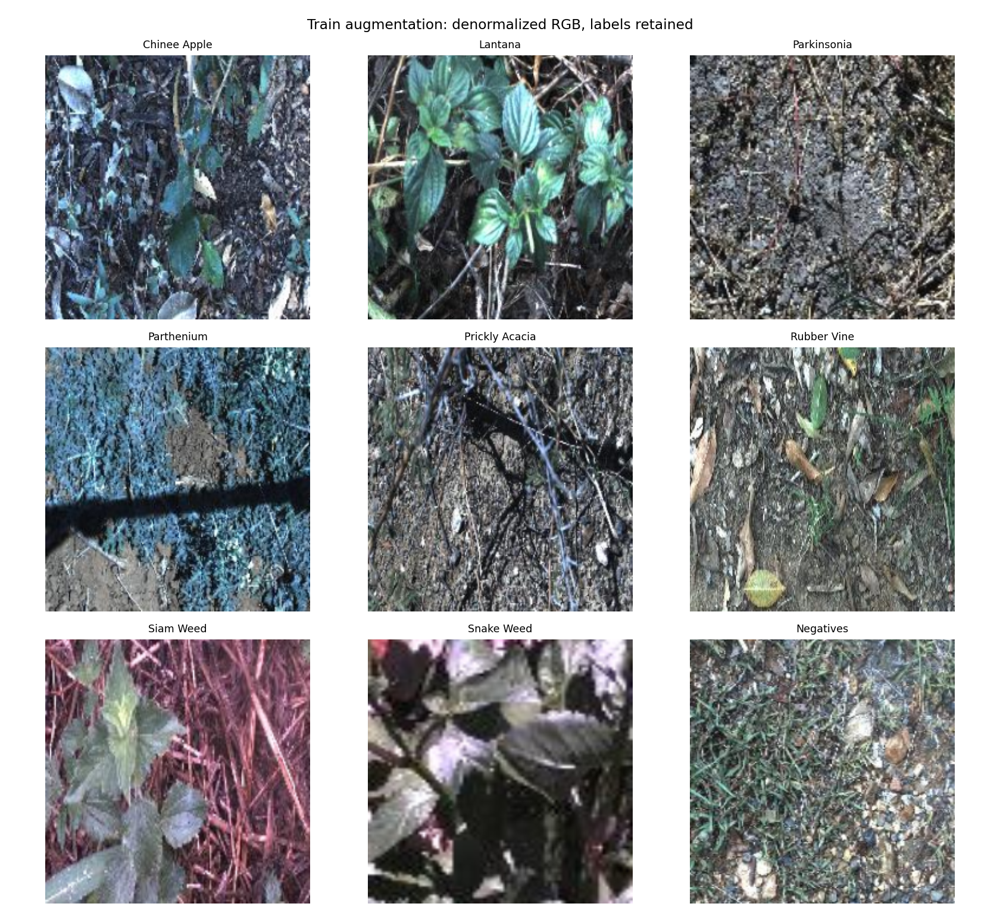
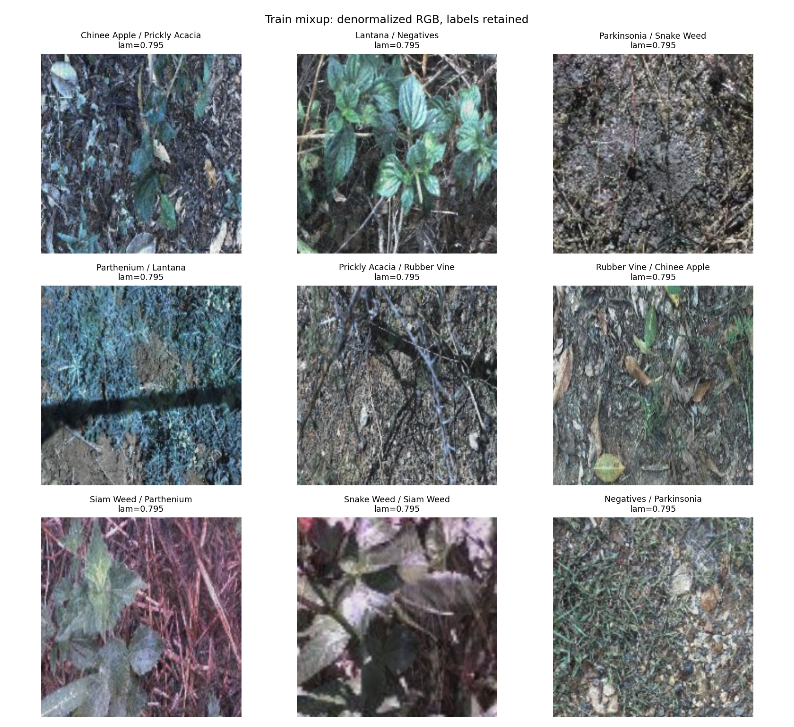
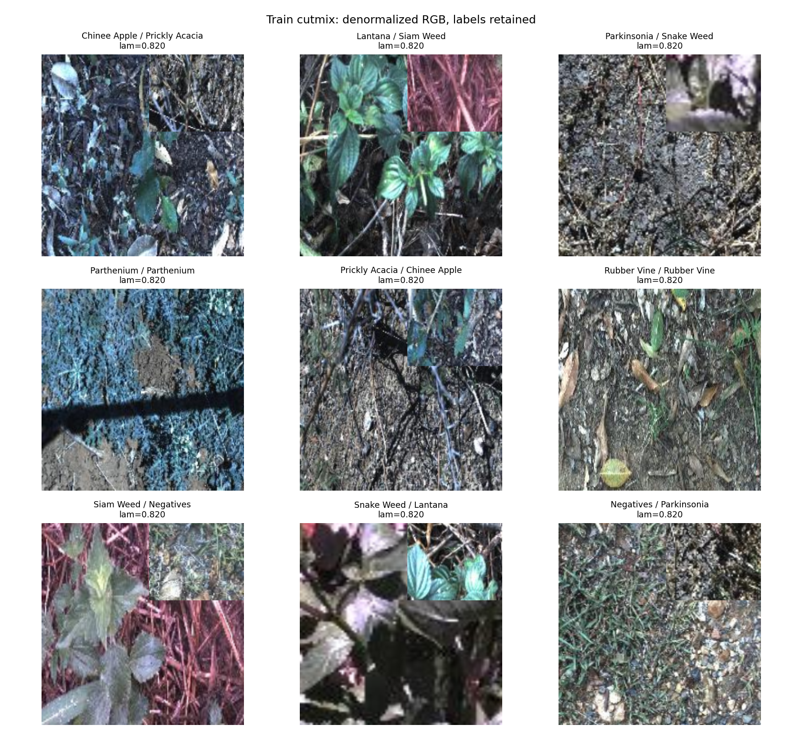

# Bước 0 — Bằng chứng từ lần chạy thật

## Dữ liệu
Fold 0 nguyên bản. Train: 10501; val: 3501; test: 3507.
Giao từng cặp: {'train_val': 0, 'train_test': 0, 'val_test': 0}; hợp: 17509; thiếu file: 0.
Khớp nhãn trong labels.csv: False; khớp Table 1: False.
Hợp tên ảnh khớp labels.csv: True.
Số nhãn fold 0 khác labels.csv: 1; chi tiết trong label_discrepancies.csv.
Chênh số ảnh từng lớp so với Table 1 (thứ tự Label 0..8): [1, -1, 0, 0, 0, 0, 0, 0, 0].
Giữ nguyên CSV tác giả; không sửa/lọc ảnh để ép số đếm khớp bảng tham khảo.
Tỉ lệ lớp lớn/nhỏ toàn dataset: 9.025.
Chỉ xem ảnh train và thông tin ảnh train/val. Không đánh giá test.
Biểu đồ: class_distribution.png; ảnh mẫu: samples_3_per_class.png (3 ảnh/lớp).
Ảnh augmentation/Mixup/CutMix có nhãn nằm trong các file *_examples.png.

### Phân bố lớp và đối chiếu dữ liệu

| Lớp | Train | Val | Test | Tổng fold 0 |
|---|---:|---:|---:|---:|
| Chinee Apple | 675 | 225 | 226 | 1126 |
| Lantana | 637 | 213 | 213 | 1063 |
| Parkinsonia | 618 | 206 | 207 | 1031 |
| Parthenium | 613 | 204 | 205 | 1022 |
| Prickly Acacia | 637 | 212 | 213 | 1062 |
| Rubber Vine | 605 | 202 | 202 | 1009 |
| Siam Weed | 644 | 215 | 215 | 1074 |
| Snake Weed | 609 | 203 | 204 | 1016 |
| Negatives | 5463 | 1821 | 1822 | 9106 |

Negatives chiếm **52,01%** tổng dữ liệu, lớn khoảng **9,02 lần** lớp nhỏ nhất
(Rubber Vine, 1009 ảnh). Mất cân bằng xuất hiện trong cả ba tập. Vì vậy accuracy
cần được đọc cùng macro-F1 và balanced accuracy; một mô hình luôn đoán Negatives
cũng đạt khoảng 52% accuracy trên val nhưng bỏ qua các loài cỏ mục tiêu.
B01 dùng CE thông thường và lấy mẫu train theo shuffle; chưa dùng trọng số lớp hay sampler cân bằng.
Hiệu quả của các cách xử lý mất cân bằng sẽ được kiểm tra bằng ablation trên val ở Bước 2.

Chênh lệch với Table 1 có nguyên nhân cụ thể: ảnh `20170714-110407-3.jpg`
trong train fold 0 có Label 0, trong `labels.csv` có Label 1. Điều này làm tổng
Chinee Apple tăng một ảnh và Lantana giảm một ảnh. Đây là khác biệt giữa các CSV
nguồn; các phép kiểm tra giao/hợp vẫn đạt. Giữ nguyên nhãn fold 0, ghi nhận trong
[label_discrepancies.csv](label_discrepancies.csv), không tự sửa nhãn.

Toàn bộ 14002 ảnh train/val được kiểm tra header đều có kích thước 256×256 và mode RGB.
Phần test chỉ kiểm tra tên file, nhãn và sự tồn tại của file; không giải mã ảnh test để EDA.

## Kiểm tra pipeline
Seed: 0; backbone: resnet50.
CE ban đầu trên 27 ảnh train cân bằng: 2.182750; ln(9): 2.197225.
Độ lệch cho phép cho head ngẫu nhiên: 0.75 (đây là kiểm tra sơ bộ).
Overfit 9 ảnh cố định: eval CE 0.000193, accuracy 1.000, 20 bước.
LR chẩn đoán: backbone 1e-3, head 1e-2, không augmentation/weight decay; trọng số này bị bỏ đi.
BN khi đóng băng giữ eval, head giữ train: True.
Unit tests riêng kiểm tra focal gamma=0, CutMix/nhãn/diện tích và hợp đồng ghi dự đoán.

Loss ban đầu lệch ln(9) khoảng 0,01448, phù hợp với head mới khởi tạo ngẫu nhiên.
Batch chẩn đoán gồm một ảnh train mỗi lớp, được cố định và xử lý bằng transform
không có augmentation ngẫu nhiên. CE eval giảm xuống 0,000193 sau 20 bước,
accuracy đạt 100%, vượt yêu cầu CE ≤ 0,05. Kết quả này cho thấy đường đi ảnh →
nhãn → loss → gradient → optimizer hoạt động trên batch nhỏ; chưa chứng minh
khả năng tổng quát hóa. B01 được khởi tạo lại từ pretrained, không dùng trọng số chẩn đoán.

Chi tiết số đo và tên chín ảnh nằm trong [pipeline_checks.json](pipeline_checks.json)
và [overfit_history.csv](overfit_history.csv).

## Lần chạy chung run(Config(...))
B01, seed 0, backbone resnet50.
Checkpoint tốt nhất: epoch 10, chọn hoàn toàn bằng macro-F1 val.
Macro-F1 val: 0.857308; top-1 val: 0.893173.
Tham số: 23.526 triệu; GMAC: 4.1095 (fvcore; xem config.json để biết ops chưa đếm).
history.csv, config.json, best.pt/last.pt và val_logits.npy nằm trong runs/B01/seed0/.
Dự đoán val: [B01_seed0_val.csv](../predictions/B01_seed0_val.csv).
Đường cong: [B01_resnet50_seed0.png](../curves/B01_resnet50_seed0.png).
Test đã chạy: False.

### Thiết lập để tái lập B01

- GPU Tesla T4; seed 0; fold 0; 10 epoch; batch size 32; hai DataLoader worker.
- Kiến trúc `resnet50`, pretrained `resnet50.a1_in1k` (ImageNet), thay head 9 lớp,
  tinh chỉnh toàn bộ backbone; timm 1.0.30, torch 2.11.0+cu130, torchvision 0.26.0+cu130.
- Train: RandomResizedCrop 224 và lật ngang. Val: resize cạnh ngắn 256, CenterCrop 224.
  Nội suy bicubic; mean/std ImageNet (0,485; 0,456; 0,406)/(0,229; 0,224; 0,225).
- AdamW; LR backbone 1e-4, head 1e-3; weight decay 0,05, loại norm/bias khỏi decay.
  Warmup một epoch rồi cosine; CE; AMP trong train, FP32 trong đánh giá.
- Không EMA, Mixup, CutMix hay loss cân bằng trong B01. Các ảnh trộn bên dưới chỉ là kiểm tra minh họa.
- Dùng batch 32 theo kế hoạch đã đo GPU; giữ cùng batch và 10 epoch cho các backbone tiếp theo.
  `drop_last=True` nên mỗi epoch cập nhật từ 10496/10501 ảnh train sau shuffle;
  val vẫn dùng đủ 3501 ảnh.

Cấu hình, tag pretrained và phiên bản đầy đủ nằm trong
[config.json](../runs/B01/seed0/config.json). Seed cho Python/NumPy/torch/worker được cố định;
cuDNN chạy chế độ deterministic. Việc tái lập trên phần cứng hoặc thư viện khác
vẫn có thể tạo khác biệt số học.

### Nhận xét kết quả huấn luyện

Theo [history.csv](../runs/B01/seed0/history.csv), train loss giảm từ **1,5531**
xuống **0,3807**, val loss giảm từ **1,0501** xuống **0,3407**. Macro-F1 val tăng
từ **44,14%** lên **85,73%**. Epoch 9 có giảm nhẹ so với epoch 8, sau đó epoch 10
đạt macro-F1 cao nhất; chọn checkpoint epoch 10 hoàn toàn bằng val.

Tại checkpoint đã chọn, top-1 val đạt **89,32%**, balanced accuracy **83,87%**,
ECE 15 bin **0,02059**. Khoảng cách giữa accuracy và balanced accuracy cho thấy
cần tiếp tục xem hiệu quả giữa các lớp, thay vì chỉ dựa vào accuracy tổng.
Đường cong 10 epoch chưa cho thấy val loss tăng kéo dài trong khi train loss giảm.
Val loss thấp hơn train loss có thể liên quan tới train dùng crop/lật ngẫu nhiên,
còn val dùng transform cố định; hai loss không được đo trên cùng điều kiện đầu vào.

Thời gian trung bình train + val mỗi epoch là **61,47 giây**, tổng 10 epoch khoảng
**10,25 phút** theo log, không tính tải dữ liệu, EDA và các kiểm tra chẩn đoán.
Đây mới là một backbone, một seed; chưa thể kết luận mô hình tốt nhất hoặc độ ổn định giữa seed.

Dự đoán val đã được kiểm tra lại bằng `eval.py` nguyên gốc: đủ 3501 ảnh, tên ảnh/nhãn
khớp `val_subset0.csv`, xác suất và argmax hợp lệ. Macro-F1, top-1 và ECE tính lại
khớp `summary.json`. Không có file dự đoán test trong kết quả Bước 0.

## Nhận xét ảnh mẫu và augmentation

### Ảnh mẫu theo lớp

Nhận xét dựa trên [ba ảnh train mỗi lớp](samples_3_per_class.png), tổng 27 ảnh.
Đây là quan sát định tính trên số ít mẫu, không phải kết luận về toàn bộ lớp.

Các mẫu Chinee Apple có lá xanh nằm xen giữa cành khô, lá rụng và nền cây cỏ;
mức độ nổi bật của cây thay đổi nhiều giữa ba ảnh. Các mẫu Snake Weed cũng có
nhiều lá trên nền cây cỏ tương tự, với màu ảnh từ xanh/xám tới xanh tím và vùng
tối do bóng. Một số mẫu nhìn gần nhau về màu và bố cục; cần học đặc trưng hình
dáng, gân lá và ngữ cảnh thay vì chỉ màu xanh. EDA này chưa chứng minh hai lớp
thực sự bị model nhầm; điều đó cần ma trận nhầm lẫn trên val.

Các mẫu Negatives vẫn chứa nhiều cây cỏ, thân, lá và đất; lớp này không đồng nghĩa
với ảnh trống hay ảnh không có cây. Nền của Negatives có thể giống nền của các lớp
cỏ mục tiêu. Sự đa dạng này, cùng số lượng mẫu lớn, làm nhiệm vụ phân loại khó hơn
việc chỉ phát hiện có thực vật trong ảnh.

Trong các lớp còn lại, một số ảnh Parkinsonia hoặc Prickly Acacia có cành mảnh
hòa vào nền khô; mẫu Lantana đầu có cụm hoa dễ nhìn, nhưng các mẫu khác không
hiện cùng tín hiệu rõ như vậy. Góc nhìn, độ che khuất và màu ảnh thay đổi đáng kể
ngay trong cùng nhãn. Một số ảnh có sắc hồng/tím hoặc xanh mạnh; không suy ra
nguyên nhân thu ảnh từ EDA này, và không tự chỉnh lại màu các ảnh nguồn.

### Crop và lật ngang

Trong ảnh đã giải chuẩn hóa, nhiều vùng lá/cành vẫn nhìn thấy và hình dạng ảnh
hợp lý, không có lỗi hiển thị giá trị tensor chuẩn hóa. Tuy nhiên crop có thể
thu hẹp ngữ cảnh và phóng lớn nền: mẫu Snake Weed khá phóng đại, Parkinsonia
và Prickly Acacia có phần cây mảnh khó tách khỏi nền. Với ảnh gán nhãn toàn ảnh,
không có bounding box hoặc mask để xác nhận mọi crop đều giữ cây mục tiêu.
Do đó chỉ xác nhận transform chạy đúng, không khẳng định mọi crop đều giữ đủ
thông tin nhãn. Khi ablation augmentation ở Bước 2 cần đánh giá ảnh hưởng trên val.

### Mixup và CutMix

Mixup minh họa có λ≈0,795: ảnh thứ nhất đóng góp khoảng 79,5%, ảnh thứ hai
khoảng 20,5%, và loss sử dụng cả hai nhãn theo cùng hệ số. Nội dung chồng lên nhau
làm giảm độ rõ của các chi tiết nhỏ; không thể kết luận có cải thiện chất lượng
mô hình chỉ từ ảnh minh họa.

CutMix minh họa có λ≈0,820 sau khi tính lại diện tích thực tế: khoảng 18% diện
tích ảnh bị thay bằng vùng từ ảnh khác. Vùng thay thế nằm ở phía trên bên phải
trong batch minh họa; trên Lantana và Snake Weed nó che hoặc thay một phần vùng
lá. Có cặp cùng lớp nên nhãn không đổi dù nội dung được thay. Cách tính hệ số
theo diện tích bảo đảm quy tắc trộn được cài đặt đúng, nhưng diện tích không
nhất thiết tương ứng với lượng cây mục tiêu nếu cây nhỏ hoặc phân bố không đều.
Vì vậy CutMix có thể che mất dấu hiệu phân loại, hoặc chỉ dán thêm nền; lợi ích
phải được xác định bằng thí nghiệm có kiểm soát trên val.

## Trạng thái Bước 0 và bước tiếp theo

Đã hoàn thành code nền dữ liệu/model/loss/train, EDA, kiểm tra pipeline và lượt
chạy B01 qua `train.run(Config(...))`. Đã lưu ảnh minh chứng, cấu hình, log,
logit/dự đoán val và checkpoint `best.pt`/`last.pt` trong `runs/B01/seed0/`.
Nhận xét ảnh mẫu và augmentation đã bổ sung từ các ảnh xuất ra trong lần chạy thật.

B01 được dùng làm mốc ResNet50 cho Bước 1. Tiếp tục so sánh ResNeXt50, ConvNeXt-Tiny,
DeiT-Small và EfficientNet-B0 với cùng công thức, seed 0, 10 epoch và batch 32.
Chỉ chọn backbone/checkpoint trên val. Test dành cho Bước 4, một lần mỗi seed.
`inference.py` và `benchmark.py` được triển khai ở Bước 3; báo cáo chung,
`results.xlsx` và các sản phẩm cuối được hoàn thiện khi có đủ thí nghiệm.
