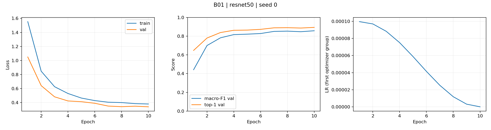
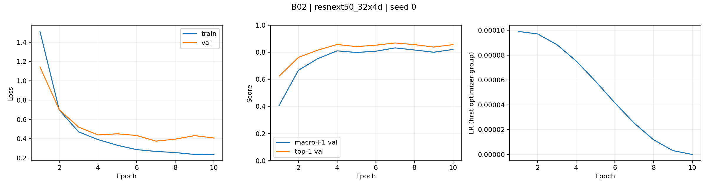
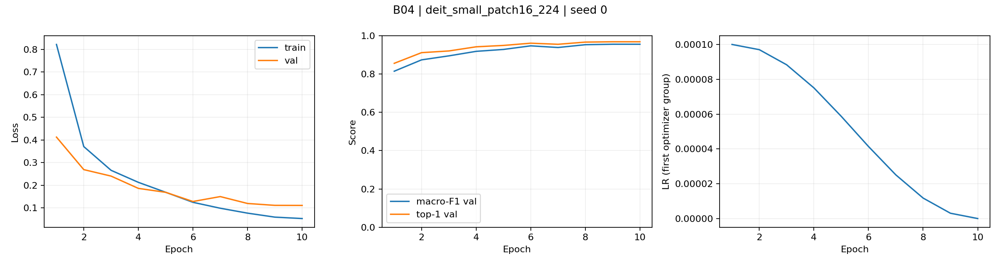
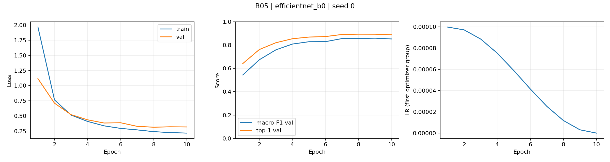

# Bước 1 — So sánh backbone

T00: kế thừa cấu hình B01, seed 0, fold 0, 10 epoch, batch 32, input 224, finetune ImageNet, AdamW, LR backbone/head 1e-4/1e-3, WD 0,05 (trừ norm/bias), warmup 1 epoch, cosine, CE, AMP. Chọn checkpoint bằng macro-F1 val.

Mean/std và nội suy lấy từ pretrained_cfg của từng tag; resize val 256 + CenterCrop 224. Đây là so sánh kiến trúc cùng công thức finetune, còn các tag ImageNet có lịch sử pretrain khác nhau.

| exp_id | Backbone | Tag | Params (M) | GMAC | F1 val | Top-1 val | Train s/epoch | Latency ms |
|---|---|---|---:|---:|---:|---:|---:|---:|
| B01 | resnet50 | a1_in1k | 23.526 | 4.109 | 85.73% | 89.32% | 49.23 | 9.532 |
| B02 | resnext50_32x4d | a1h_in1k | 22.998 | 4.257 | 83.28% | 86.92% | 58.04 | 16.976 |
| B03 | convnext_tiny | fb_in1k | 27.827 | 4.470 | 96.30% | 97.37% | 63.28 | 7.293 |
| B04 | deit_small_patch16_224 | fb_in1k | 21.669 | 4.608 | 95.57% | 96.86% | 43.04 | 4.644 |
| B05 | efficientnet_b0 | ra_in1k | 4.019 | 0.398 | 85.93% | 89.35% | 46.76 | 7.527 |

Chọn **B03 — convnext_tiny** cho Bước 2, macro-F1 val **96.30%**, latency sơ bộ **7.293 ms**. Kế hoạch GPU dành ablation cho một backbone.
Nhanh nhất trong phép đo sơ bộ: B04 (4.644 ms), macro-F1 val 95.57%.

Chênh F1 giữa hai model đứng đầu: 0.728 điểm phần trăm. Mỗi model chỉ có một seed: thứ hạng này là quan sát screening, chưa chứng minh khác biệt thống kê.

## Hội tụ và dấu hiệu overfit

- B01: đạt 95% F1 tốt nhất của chính model từ epoch 4; train loss 1.5531 → 0.3807, val loss 1.0501 → 0.3407. Ba epoch cuối không có tín hiệu train loss giảm/val loss tăng liên tiếp; vẫn cần đọc toàn bộ đường cong.
- B02: đạt 95% F1 tốt nhất của chính model từ epoch 4; train loss 1.5111 → 0.2392, val loss 1.1433 → 0.4078. Ba epoch cuối không có tín hiệu train loss giảm/val loss tăng liên tiếp; vẫn cần đọc toàn bộ đường cong.
- B03: đạt 95% F1 tốt nhất của chính model từ epoch 3; train loss 1.0669 → 0.0540, val loss 0.4238 → 0.1006. Ba epoch cuối không có tín hiệu train loss giảm/val loss tăng liên tiếp; vẫn cần đọc toàn bộ đường cong.
- B04: đạt 95% F1 tốt nhất của chính model từ epoch 4; train loss 0.8216 → 0.0526, val loss 0.4123 → 0.1105. Ba epoch cuối không có tín hiệu train loss giảm/val loss tăng liên tiếp; vẫn cần đọc toàn bộ đường cong.
- B05: đạt 95% F1 tốt nhất của chính model từ epoch 5; train loss 1.9656 → 0.2185, val loss 1.1154 → 0.3197. Ba epoch cuối không có tín hiệu train loss giảm/val loss tăng liên tiếp; vẫn cần đọc toàn bộ đường cong.

Mốc 95% là tiêu chí mô tả so với đỉnh riêng của mỗi model; không đồng nghĩa model đạt chất lượng tuyệt đối tốt hơn hoặc hội tụ hoàn toàn.

## Tốc độ, GMAC và giới hạn

Latency: batch 1, FP32, 10 warmup rồi đo một forward, synchronize CUDA hai đầu; input tensor 0 đã ở GPU, chỉ tính forward, loại tải ảnh/tiền xử lý/truyền dữ liệu. Cùng T4 và phiên bản thư viện. Đây là phép đo sơ bộ có nhiễu; p50/p95/p99 ở Bước 3.
GMAC từ fvcore, 1 FMA = 1 operation; xem unsupported_ops trong config từng run. GMAC không đo truy cập bộ nhớ hay hiệu quả kernel; đối chiếu bảng trước khi dùng để suy ra tốc độ.

GMAC tăng dần: B05 → B01 → B02 → B03 → B04.
Thời gian train tăng dần: B04 → B05 → B01 → B02 → B03.
Latency sơ bộ tăng dần: B04 → B03 → B05 → B01 → B02.
Thứ tự GMAC và latency không trùng trong phép đo này; một forward/model chưa đủ để đánh giá độ ổn định của tương quan.

## Đối chiếu ImageNet

Nguồn: [bảng kết quả timm](https://raw.githubusercontent.com/huggingface/pytorch-image-models/main/results/results-imagenet.csv), khớp chính xác tag và input 224; snapshot trong imagenet_reference.csv.

| Tag | Top-1 ImageNet | Crop pct | Nội suy |
|---|---:|---:|---|
| convnext_tiny.fb_in1k | 82.066% | 0.875 | bicubic |
| resnext50_32x4d.a1h_in1k | 81.140% | 0.950 | bicubic |
| resnet50.a1_in1k | 80.382% | 0.950 | bicubic |
| deit_small_patch16_224.fb_in1k | 79.856% | 0.900 | bicubic |
| efficientnet_b0.ra_in1k | 77.698% | 0.875 | bicubic |

ImageNet top-1 giảm dần: convnext_tiny.fb_in1k → resnext50_32x4d.a1h_in1k → resnet50.a1_in1k → deit_small_patch16_224.fb_in1k → efficientnet_b0.ra_in1k.
DeepWeeds macro-F1 giảm dần: convnext_tiny.fb_in1k → deit_small_patch16_224.fb_in1k → efficientnet_b0.ra_in1k → resnet50.a1_in1k → resnext50_32x4d.a1h_in1k.
Hai thứ hạng khác nhau.
Hai bài toán/metric và điều kiện đánh giá khác nhau; top-1 ImageNet không bảo đảm thứ hạng macro-F1 sau finetune trên DeepWeeds.

## Bằng chứng

Cấu hình/log/checkpoint: runs/B0x/seed0. Dự đoán val: predictions/B0x_seed0_val.csv. Không đánh giá test trong Bước 1.
