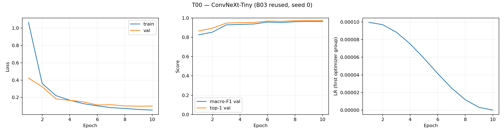
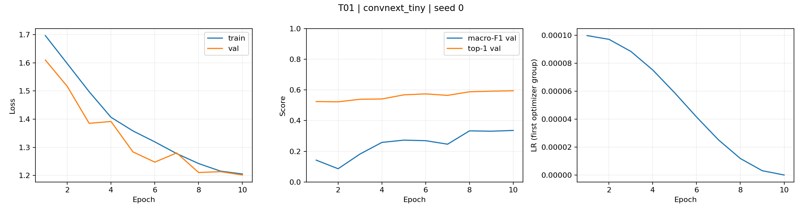
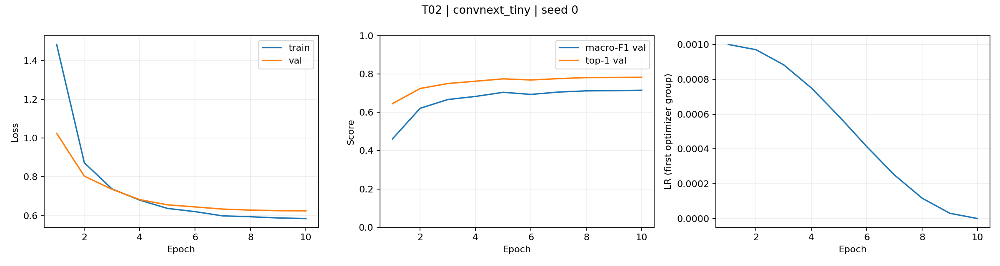
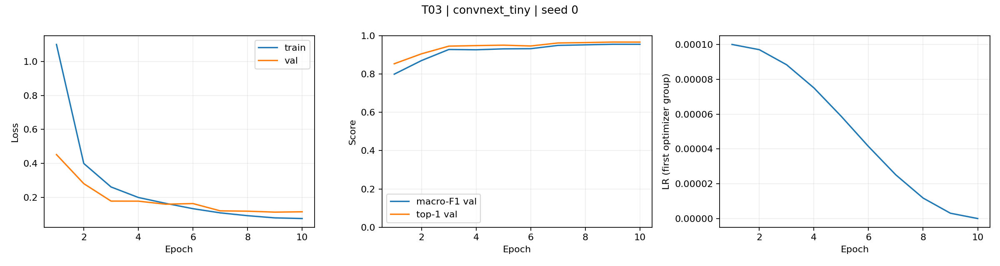
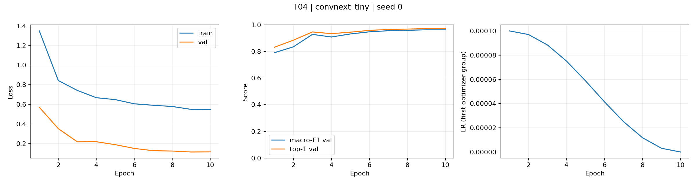
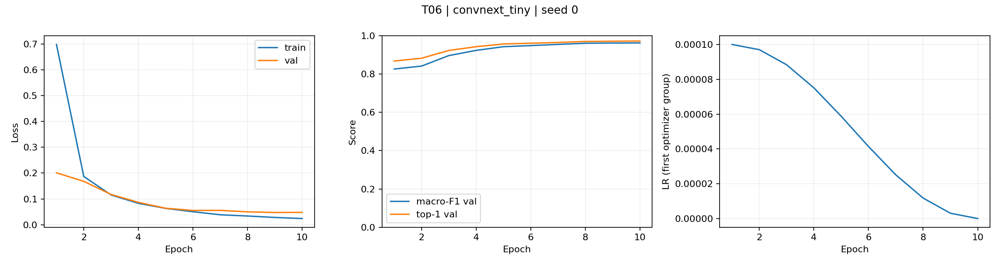
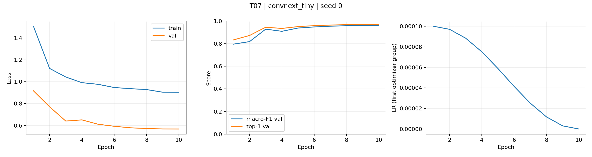

# Bước 2 — Công thức huấn luyện ConvNeXt-Tiny

T00 là kết quả B03 đã chạy: ConvNeXt-Tiny fb_in1k, seed 0, fold 0, 10 epoch, batch 32. Không train lại T00. T01–T06 đều bắt đầu từ khởi tạo quy định (ImageNet hoặc scratch), không tiếp tục từ checkpoint B03 hay từ một thí nghiệm khác.

## Thiết kế có kiểm soát

Ba trục, mỗi trục ba giá trị tính cả T00: init (finetune/scratch/frozen), augmentation (basic/color/CutMix), loss (CE/label smoothing 0,1/focal gamma 2). Không thay nền theo kiểu tham lam. T01–T06 chỉ đổi một yếu tố so với T00; T05 đổi cả tên loss và epsilon để mô tả cùng một yếu tố label smoothing. T07 là ngoại lệ được khai báo trước để kiểm tra kết hợp hai yếu tố.

Giữ backbone, tag, seed, kích thước ảnh, optimizer, LR, WD, warmup/cosine, epoch/batch và cách chọn checkpoint; frozen không cập nhật backbone. B01 dùng AdamW, LR backbone/head 1e-4/1e-3, WD 0,05 trừ norm/bias; các lượt T kế thừa đúng công thức này. Train crop+lật, val resize 256/crop 224; mean/std ImageNet và nội suy bicubic. AMP train, FP32 val. Chỉ val; không đánh giá test.

| exp_id | Trục | Biến thể | F1 val | Δ pp | Top-1 | ECE | NLL |
|---|---|---|---:|---:|---:|---:|---:|
| T00 | Baseline | B03 reused; no new training | 96.30% | +0.000 | 97.37% | 0.00801 | 0.09934 |
| T01 | A. Initialization | Scratch | 33.60% | -62.699 | 59.47% | 0.02011 | 1.20159 |
| T02 | A. Initialization | Frozen backbone | 71.53% | -24.773 | 78.32% | 0.05398 | 0.62457 |
| T03 | B. Augmentation | ColorJitter | 95.56% | -0.742 | 96.72% | 0.00928 | 0.11272 |
| T04 | B. Augmentation | CutMix alpha=1 | 96.30% | +0.001 | 97.20% | 0.02505 | 0.11440 |
| T05 | C. Loss | Label smoothing epsilon=0.1 | 96.41% | +0.108 | 97.37% | 0.09615 | 0.18525 |
| T06 | C. Loss | Focal gamma=2 | 96.25% | -0.048 | 97.23% | 0.06809 | 0.14966 |
| T07 | Combination | T04 + T05 | 96.15% | -0.156 | 97.12% | 0.11209 | 0.20268 |

## Kết quả từng trục và các lớp khó

- Initialization: giá trị tốt nhất theo val là T00 (B03 reused; no new training), F1 96.30%, Δ +0.000 pp.
  - T01: F1 Chinee Apple 29.04%, Snake Weed 27.34%; T00 lần lượt 93.03%, 92.38%.
  - T02: F1 Chinee Apple 65.01%, Snake Weed 60.66%; T00 lần lượt 93.03%, 92.38%.
- Augmentation: giá trị tốt nhất theo val là T04 (CutMix alpha=1), F1 96.30%, Δ +0.001 pp.
  - T03: F1 Chinee Apple 90.44%, Snake Weed 91.44%; T00 lần lượt 93.03%, 92.38%.
  - T04: F1 Chinee Apple 92.65%, Snake Weed 91.67%; T00 lần lượt 93.03%, 92.38%.
- Loss: giá trị tốt nhất theo val là T05 (Label smoothing epsilon=0.1), F1 96.41%, Δ +0.108 pp.
  - T05: F1 Chinee Apple 93.45%, Snake Weed 91.63%; T00 lần lượt 93.03%, 92.38%.
  - T06: F1 Chinee Apple 92.83%, Snake Weed 92.04%; T00 lần lượt 93.03%, 92.38%.

Chi tiết cả chín lớp và Δ với T00 nằm trong [per_class_f1.csv](per_class_f1.csv). Loss focal không dùng alpha/trọng số lớp; do đó không giả định tự động cải thiện lớp hiếm. Color và CutMix phải được đánh giá qua val; train accuracy với nhãn trộn không được dùng để chọn model.

## Kiểm tra kết hợp

T07 kết hợp T04 và T05, được chọn giữa các biến thể mới của mỗi trục bằng macro-F1 val, giữ init=finetune. Có thể cả hai biến thể vẫn thua T00; thử kết hợp không đồng nghĩa đã chứng minh chúng tốt.
Tổng Δ của hai thí nghiệm riêng: +0.109 pp; Δ thực của T07: -0.156 pp; phần khác tổng đơn giản: -0.265 pp. Đây là mô tả tương tác trên một seed, không phải kiểm định hiệu ứng cộng dồn. Kế hoạch được lưu trước khi train trong combination_plan.json.

## Δ và giới hạn nhiễu

Mỗi cấu hình chỉ có một seed; std giữa các seed chưa được đo. Không thể kết luận ưu thế ổn định chỉ từ Δ nhỏ. Khoảng dưới đây là bootstrap ghép cặp/phân tầng trên cùng ảnh val (200 lần, seed 0), đo biến thiên theo mẫu val, không thay thế std huấn luyện. Các cấu hình đã được chọn trên val nên các khoảng này chỉ mang tính mô tả, không phải bằng chứng xác nhận sau lựa chọn. Mean ± std giữa seed được báo cáo ở Bước 4.

| exp_id | Δ pp | Khoảng bootstrap 95% (pp) | Bootstrap std (pp) |
|---|---:|---:|---:|
| T01 | -62.699 | [-64.762, -60.638] | 1.050 |
| T02 | -24.773 | [-26.754, -22.783] | 0.976 |
| T03 | -0.742 | [-1.453, -0.149] | 0.351 |
| T04 | +0.001 | [-0.652, +0.641] | 0.324 |
| T05 | +0.108 | [-0.339, +0.454] | 0.207 |
| T06 | -0.048 | [-0.533, +0.379] | 0.241 |
| T07 | -0.156 | [-0.840, +0.368] | 0.317 |

## Hội tụ và khả năng tổng quát hóa

Raw loss giữa CE/label smoothing/focal không cùng thang ý nghĩa; so sánh chất lượng bằng macro-F1, top-1, NLL chung từ xác suất và ECE. Đường cong loss dùng để theo dõi từng run, không dùng loss focal thấp hơn CE làm bằng chứng tốt hơn.
- T00: checkpoint epoch 9; val loss 0.4238 → 0.1006; train 63.28 s/epoch.
- T01: checkpoint epoch 10; val loss 1.6100 → 1.2016; train 63.21 s/epoch.
- T02: checkpoint epoch 10; val loss 1.0243 → 0.6246; train 38.10 s/epoch.
- T03: checkpoint epoch 9; val loss 0.4519 → 0.1147; train 97.90 s/epoch.
- T04: checkpoint epoch 9; val loss 0.5704 → 0.1154; train 63.35 s/epoch.
- T05: checkpoint epoch 9; val loss 0.8084 → 0.5609; train 63.14 s/epoch.
- T06: checkpoint epoch 10; val loss 0.2011 → 0.0478; train 62.85 s/epoch.
- T07: checkpoint epoch 10; val loss 0.9171 → 0.5682; train 63.57 s/epoch.

Chọn **T05 (Label smoothing epsilon=0.1)** cho bước suy luận: macro-F1 val **96.41%**, Δ so với T00 **+0.108 pp**. Đây là quyết định screening bằng điểm val, chưa có std giữa seed.

## Bằng chứng

Ảnh T00 được vẽ từ log B03 với tiêu đề T00; không có lượt train T00 mới.

Cấu hình, log, logits và checkpoint: runs/<source_exp_id>/seed0. Đường cong: curves/. Dự đoán chỉ val: predictions/. Không mở test để chọn cấu hình.

## Nhận xét sau đối chiếu kết quả tải về

Đủ sáu ablation riêng và một lượt kết hợp trên ConvNeXt-Tiny, cộng T00 dùng lại B03.
Tổng thời gian train + val ghi trong log T01–T07 là **92,96 phút**; không tính setup,
tải dữ liệu, xuất/tải ZIP hoặc thời gian chờ. T02 frozen nhanh nhất, **8,89 phút**;
T03 ColorJitter lâu nhất, **18,84 phút**. Các lượt khác khoảng 13 phút.

- T01 scratch và T02 frozen đều chọn epoch cuối (10), loss train/val giảm từ đầu đến cuối.
  Trong cùng ngân sách 10 epoch, finetune tốt hơn rõ rệt; chưa thể suy ra scratch đã hội tụ
  hoặc vẫn kém như vậy nếu được huấn luyện lâu hơn.
- T03 và T05 đạt F1 tốt nhất ở epoch 9 rồi giảm nhẹ ở epoch 10. T03 val loss tăng từ
  checkpoint đến cuối trong khi train loss giảm; đây là dấu hiệu cần theo dõi, chưa đủ
  để kết luận quá khớp mạnh từ một epoch cuối. T05 raw val loss là CE có smoothing,
  không so trực tiếp với raw val loss CE của T00.
- CutMix T04 hơn T00 **0,0013 pp**, xem như ngang nhau trong lần chạy này. T05 hơn T00
  **0,1075 pp**, nhưng bootstrap val 95% cho Δ là **[-0,3389; +0,4542] pp**, chứa 0;
  chưa có std giữa seed. Chọn T05 theo quy tắc F1 val đã khai báo, chưa chứng minh ưu thế ổn định.
- T07 kết hợp T04 + T05 đạt 96,15%, thấp hơn T05 khoảng **0,264 pp**. Lần chạy này
  không cho thấy hiệu ứng cộng dồn; nhiễu và tương tác cần nhiều seed mới phân biệt được.
- T05 có ECE **0,09615** và NLL **0,18525**, cao hơn T00 (**0,00801**, **0,09934**).
  Điểm F1 cao hơn không kéo theo xác suất được hiệu chuẩn tốt hơn. Bước 3 cần giữ T00
  làm mốc, khớp temperature trên val và so cả F1/ECE/độ trễ.

Đã đối chiếu cùng 3.501 ảnh val với CSV fold 0 gốc; logits, xác suất và metric khớp.
Bảy best.pt đọc được bằng weights_only, đúng cấu trúc ConvNeXt-Tiny 9 lớp,
epoch và macro-F1 khớp summary. Đủ tám PNG T00–T07, không có dự đoán test.
ZIP gốc được giữ trong runs/step2_import; SHA-256 và chi tiết nhập lưu tại import_manifest.json.
