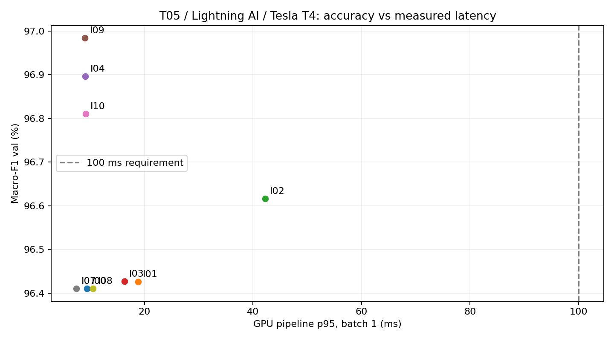

# Bước 3 — Suy luận và độ trễ

Checkpoint T05 ConvNeXt-Tiny fb_in1k, seed 0. Không train lại, không đánh giá test. Val có 3.501 ảnh theo CSV fold 0 gốc. I00 dùng lại logit T05; I07 và I03 dùng cache, I01/I02/độ phân giải/AMP chạy lại model trên val.

## Phương pháp và số đo

| ID | Phương pháp | K | F1 val | Top-1 | ECE | p50/p95/p99 batch 1 (ms) | × I00 (p50) | ảnh/s batch 32 |
|---|---|---:|---:|---:|---:|---:|---:|---:|
| I00 | 1 view FP32 | 1 | 96.41% | 97.37% | 0.09615 | 8.171/9.390/9.760 | 1.00 | 287.9 |
| I01 | Hflip TTA / probability | 2 | 96.43% | 97.34% | 0.09709 | 15.593/18.862/20.783 | 1.91 | 141.7 |
| I02 | 5 crops / probability | 5 | 96.62% | 97.54% | 0.09960 | 25.504/42.253/44.456 | 3.12 | 56.0 |
| I03 | Hflip TTA / logits | 2 | 96.43% | 97.34% | 0.09718 | 14.316/16.359/17.286 | 1.75 | 140.0 |
| I04 | Resolution 256 | 1 | 96.90% | 97.66% | 0.09549 | 5.763/9.138/9.337 | 0.71 | 219.5 |
| I09 | Resolution 288 | 1 | 96.98% | 97.71% | 0.10381 | 8.536/9.068/9.182 | 1.04 | 168.3 |
| I10 | Resolution 320 | 1 | 96.81% | 97.63% | 0.11564 | 8.567/9.153/9.225 | 1.05 | 141.1 |
| I07 | 1 view + temperature | 1 | 96.41% | 97.37% | 0.00474 | 5.064/7.491/8.597 | 0.62 | 280.7 |
| I08 | 1 view AMP FP16 | 1 | 96.41% | 97.37% | 0.09613 | 7.083/10.559/11.857 | 0.87 | 721.0 |

## Điều kiện đo và giới hạn triển khai

Nền tảng Lightning AI, GPU Tesla T4; torch 2.8.0+cu128, torchvision 0.23.0+cu128, timm 1.0.30, CUDA 12.8, cuDNN 91002. Đã đối chiếu FP32 logits/dự đoán toàn bộ val với T05 trước khi dùng cache. Mỗi phương pháp đo batch 1 và 32, 10 warmup bỏ đi và 100 lần đo; synchronize ngay trước/sau mỗi lần, perf_counter. Giữ raw samples_ms để tính lại phân vị. Thông lượng = batch / mean thời gian batch.

Input đã resize/crop/normalize và có trên GPU. Đo gồm tensor flip/crop, forward(s), softmax và gộp view/chia T; không gồm đọc ảnh, PIL preprocessing, H2D/D2H hay tải model. Do đó p95<=100 ms là tiêu chí pipeline GPU, chưa chứng minh toàn hệ thống camera/robot <=100 ms. Five-crop chạy lần lượt năm view, không gộp thành một batch 5 lần lớn hơn. Các độ phân giải dùng resize round(size*256/224) và crop size; giữ tỷ lệ crop giống I00.

## Hiệu chuẩn

I07 khớp T=0.610666 trên val bằng NLL; miền tìm [exp(-6),exp(6)], biên tìm kiếm: False. ECE 0.09615 → 0.00474; NLL 0.18525 → 0.10608. Top-1 và macro-F1 giữ nguyên.
Khớp và đo ECE trên cùng val nên kết quả hiệu chuẩn có thể lạc quan; không khớp lại T trên test. I07 chỉ hiệu chuẩn 1-view. Không giả định T này tối ưu cho TTA hay độ phân giải khác.

## Gộp view và độ phân giải

Hflip: gộp prob I01 F1 96.43%, gộp logit I03 F1 96.43%. Cùng hai view; chọn bằng val, không giả định một cách luôn tốt hơn.
I04/I09/I10 là dò 256/288/320 từ cùng checkpoint, không đổi tham số. Không suy ra latency chỉ bằng FLOPs hay nhân K; tất cả được đo thật.

## BN, EMA và ensemble

ConvNeXt-Tiny có LayerNorm, không có BatchNorm2d: gộp BN không áp dụng. T05 không train EMA nên không tạo một mục EMA giả. Không thử soup/ensemble trong ngân sách này; đã có ít nhất bốn nhóm phương pháp ngoài 1-view (hflip, 5 crop, resolution, calibration, AMP).

## Chọn bằng val

Ngoại tuyến: I09 (Resolution 288), F1 96.98%, p95 9.068 ms.
Có ràng buộc 100 ms: I09 (Resolution 288), F1 96.98%, p95 9.068 ms.
Nhanh nhất theo p95: I07 (7.491 ms). Phương án K view cần đối chiếu mức tăng F1 với chi phí tương đối trong bảng. Nếu không tăng rõ, 1-view/calibration/AMP là lựa chọn cần cân nhắc cho xử lý trực tiếp.

Mọi metric là một checkpoint/seed. Chênh lệch nhỏ chưa chứng minh cải thiện ổn định. Selection.json giữ phương pháp và T cụ thể; Bước 4 mới huấn luyện nhiều seed và chạy test.

Dự đoán: predictions/Ixx_seed0_val.csv. Logits/probs và raw timing: step3/Ixx/. Nguồn checkpoint/môi trường train: source.json. Môi trường suy luận thực tế: runtime.json. Không gộp latency từ Colab và Lightning. Conditions chi tiết: latency_batch1/32.json.
